# Bugfix Workflow (verbatim)

---

# Bugfix Requirements-First Workflow Path

## Overview

This workflow guides you through fixing a bug using the bug condition methodology.
It ensures systematic validation through:
- **Fix Checking**: Verify the bug is fixed for all buggy inputs
- **Preservation Checking**: Verify existing behavior is unchanged

## Prerequisites

- User has chosen "Start with Requirements" from entry point selection
- Spec name has been determined (kebab-case format)

---

## Bug Condition Methodology

This workflow uses the bug condition methodology:
- **C(X)**: Bug Condition - identifies inputs that trigger the bug
- **P(result)**: Property - desired behavior for buggy inputs
- **¬C(X)**: Non-buggy inputs that should be preserved
- **F**: Original (unfixed) function
- **F'**: Fixed function

## Key Concepts

| Concept | Definition | Example |
|---------|------------|---------|
| **C(X)** | Bug Condition - identifies buggy inputs | `X.quantity == 0` |
| **P(result)** | Property - desired behavior for C(X) | `(no crash) AND (returns "N/A")` |
| **¬C(X)** | Non-buggy inputs - should be preserved | `X.quantity != 0` |
| **F** | Original (unfixed) function | The code before the fix |
| **F'** | Fixed function | The code after the fix |
| **Counterexample** | Concrete example demonstrating the bug | `calculatePrice(0, 10)` crashes |

---

# VAGUENESS DETECTION - CRITICAL FIRST STEP

Before starting the workflow, you MUST evaluate the user's bug description for vagueness. A bug description is considered VAGUE if it lacks ANY of the following essential elements:

**Essential Elements for a Complete Bug Description:**
1. **What happens** - The observable incorrect behavior or symptom
2. **When it happens** - The conditions, inputs, or steps that trigger the bug
3. **What should happen** - The expected correct behavior (can sometimes be inferred)

**Indicators of Vagueness:**
- Generic statements like "it doesn't work", "it's broken", "there's a bug"
- Missing trigger conditions (no mention of when/how the bug occurs)
- No specific error messages, symptoms, or observable behavior described
- Ambiguous scope (unclear which feature, component, or flow is affected)
- Missing reproduction steps or context

**When Vagueness is Detected:**
If the bug description is vague, you MUST ask the user for clarification BEFORE proceeding with the workflow. Ask targeted questions such as:
- "Can you describe what specifically happens when the bug occurs? (e.g., error message, incorrect output, crash)"
- "What steps or conditions trigger this bug? How can it be reproduced?"
- "What did you expect to happen instead?"
- "Which part of the application or feature is affected?"

**You MUST NOT proceed to create bugfix.md until you have enough information to:**
- Identify the bug condition (what inputs/conditions trigger the bug)
- Describe the current defective behavior
- Define the expected correct behavior

---

## The Four Phases of Bug Fixing

```mermaid
sequenceDiagram
    participant Dev
    participant UC as UNFIXED
    participant Tests as Tests
    participant Fix as FIXED

    Note over Dev,Tests: EXPLORE
    Dev->>Tests: Write exploratory tests
    Tests->>UC: Run UNFIXED code
    UC-->>Tests: FAIL (expected)
    Dev->>UC: Examine counterexamples

    Note over Dev,UC: PRESERVE
    Dev->>Tests: Write preservation tests
    Tests->>UC: Verify preservation tests PASS on UNFIXED code

    Note over Dev,Fix: IMPLEMENT
    Dev->>Fix: Apply fix

    Note over Tests,Fix: VALIDATE
    Tests->>Fix: Run tests
    Tests-->>Dev: Verify
```



---

## Workflow Steps

### Phase 1: Create Requirements

## Bugfix Requirements Gathering Phase

### Objective

Gather requirements for a bugfix using the bug condition methodology.
This approach ensures systematic validation through:
- **Fix Checking**: Verify the bug is fixed for all buggy inputs
- **Preservation Checking**: Verify existing behavior is unchanged for non-buggy inputs

### Process

1. **Bug Analysis**: Understand what's broken and when it happens
2. **Document Current Behavior**: Capture the defective behavior
3. **Document Expected Behavior**: Define what should happen instead
4. **Document Unchanged Behavior**: Identify what must be preserved
5. **User Review**: Present requirements for review

## Iteration and Feedback Rules

- The model MUST make modifications if the user requests changes
- The model MUST incorporate all user feedback before proceeding
- The model MUST offer to return to previous steps if gaps are identified

## Phase Completion

After completing the document for this phase, the model MUST stop. The user will click a button in the UI to move to the next phase.

### Constraints

- The model MUST create a '.kiro/specs/{feature_name}/bugfix.md' file using the absolute file path
- The model MUST generate an initial version based on the bug description
- The model MUST use the user_input tool with reason 'general-question' when asking clarifying questions before bugfix.md exists
- The model MAY ask clarifying questions if the bug condition cannot be derived

### Bugfix Requirements Format

**CRITICAL: bugfix.md MUST ONLY contain the following sections:**
1. Introduction
2. Bug Analysis
   - Current Behavior (Defect)
   - Expected Behavior (Correct)
   - Unchanged Behavior (Regression Prevention)

**DO NOT include any of the following in bugfix.md - these belong in design.md:**
- Technical Context
- Implementation Details
- Design sections
- Code architecture information
- File/component analysis

**CRITICAL: All requirements clauses MUST be numbered using the format X.Y where X is the section number and Y is the clause number within that section.**

Use these clause patterns for each section:

**Current Behavior (Defect)** - What's broken (Section 1):
```
1.1 WHEN [condition that triggers bug] THEN the system [incorrect behavior]
1.2 WHEN [condition that triggers bug] THEN the system [incorrect behavior]
```

**Expected Behavior (Correct)** - What should happen (Section 2):
```
2.1 WHEN [condition that triggers bug] THEN the system SHALL [correct behavior]
2.2 WHEN [condition that triggers bug] THEN the system SHALL [correct behavior]
```

**Unchanged Behavior (Regression Prevention)** - What must stay the same (Section 3):
```
3.1 WHEN [condition that doesn't trigger bug] THEN the system SHALL CONTINUE TO [existing behavior]
3.2 WHEN [condition that doesn't trigger bug] THEN the system SHALL CONTINUE TO [existing behavior]
```

**Note:** Each Current Behavior clause should have a corresponding Expected Behavior clause that describes the correct behavior for that same condition.

### Example Bugfix Requirements

**Bug**: "App crashes when calculating price with zero quantity"

```markdown
## Bug Analysis

### Current Behavior (Defect)

1.1 WHEN quantity is zero THEN the system crashes with division by zero error
1.2 WHEN quantity is negative THEN the system returns incorrect calculation

### Expected Behavior (Correct)

2.1 WHEN quantity is zero THEN the system SHALL return "N/A" without crashing
2.2 WHEN quantity is negative THEN the system SHALL return a validation error

### Unchanged Behavior (Regression Prevention)

3.1 WHEN quantity is positive THEN the system SHALL CONTINUE TO calculate price correctly
3.2 WHEN quantity is a decimal value THEN the system SHALL CONTINUE TO calculate price correctly
```

### Deriving the Bug Condition

From the requirements, derive the bug condition and property using structured pseudocode:

**Bug Condition Function** - Identifies inputs that trigger the bug:
```pascal
FUNCTION isBugCondition(X)
  INPUT: X of type InputType
  OUTPUT: boolean
  
  // Returns true when the bug condition is met
  RETURN [predicate that identifies buggy inputs]
END FUNCTION
```

Example:
```pascal
FUNCTION isBugCondition(X)
  INPUT: X of type PriceInput
  OUTPUT: boolean
  
  RETURN X.quantity = 0
END FUNCTION
```

**Property Specification** - Defines correct behavior for buggy inputs:
```pascal
// Property: Fix Checking
FOR ALL X WHERE isBugCondition(X) DO
  result ← F'(X)
  ASSERT [expected behavior predicate]
END FOR
```

Example:
```pascal
// Property: Fix Checking - Zero Quantity Handling
FOR ALL X WHERE isBugCondition(X) DO
  result ← calculatePrice'(X)
  ASSERT result = "N/A" AND no_crash(result)
END FOR
```

**Key Definitions:**
- **F**: The original (unfixed) function - the code as it exists before the fix
- **F'**: The fixed function - the code after applying the fix

**Preservation Goal** - Expressed in structured pseudocode:
```pascal
// Property: Preservation Checking
FOR ALL X WHERE NOT isBugCondition(X) DO
  ASSERT F(X) = F'(X)
END FOR
```

This ensures that for all non-buggy inputs, the fixed code behaves identically to the original.

### Asking Clarifying Questions

If the bug description is unclear, ask clarifying questions using reason 'general-question':
- "What exactly happens when the bug occurs?"
- "What inputs or conditions trigger this bug?"
- "What should happen instead?"
- "Are there related scenarios that should continue working?"

### Template

```markdown
# Bugfix Requirements: [Bug Name]

## Introduction

[Summary of the bug being fixed and its impact]

## Bug Analysis

### Current Behavior (Defect)

[What currently happens when the bug is triggered]

1.1 WHEN [condition] THEN the system [incorrect behavior]
1.2 WHEN [condition] THEN the system [incorrect behavior]

### Expected Behavior (Correct)

[What should happen instead]

2.1 WHEN [condition] THEN the system SHALL [correct behavior]
2.2 WHEN [condition] THEN the system SHALL [correct behavior]

### Unchanged Behavior (Regression Prevention)

[Existing behavior that must be preserved]

3.1 WHEN [condition] THEN the system SHALL CONTINUE TO [existing behavior]
3.2 WHEN [condition] THEN the system SHALL CONTINUE TO [existing behavior]
```

---

### Phase 2: Create Design

## Bugfix Design Creation Phase

### Objective

Create a design document that formalizes the bug condition and validation approach.
This ensures the fix is targeted, minimal, and doesn't introduce regressions.

### Process

1. **Formalize Bug Condition**: Define C(X) using formal set notation from requirements
2. **Define Expected Behavior**: Specify P(result) for correct behavior
3. **Identify Preservation Requirements**: Document unchanged behaviors
4. **Hypothesize Root Cause**: Analyze potential causes based on bug description
5. **Plan Implementation**: Outline specific changes required
6. **Plan Testing Strategy**: Define exploratory, fix, and preservation checking approaches

### Constraints

- The model MUST create a '.kiro/specs/{feature_name}/design.md' file using the absolute file path
- The model MUST include all sections from the template: Overview, Glossary, Bug Details, Expected Behavior, Hypothesized Root Cause, Fix Implementation, Testing Strategy
- The model MUST use pseudocode for Bug Condition specification (FUNCTION isBugCondition)
- The model MUST use pseudocode for Properties specification (FUNCTION expectedBehavior)
- The model MUST include concrete examples of bug manifestation
- The model MUST document preservation requirements with specific unchanged behaviors
- The model MUST hypothesize root causes based on bug analysis
- The model MUST outline specific implementation changes
- The model MUST include three testing categories: Unit Tests, Property-Based Tests, Integration Tests

### Design Document Structure

The model MUST include these sections in order:
1. **Overview**: High-level description of bug and fix approach
2. **Glossary**: Define Bug_Condition (C), Property (P), Preservation, and domain-specific terms
3. **Bug Details**: Bug Condition with formal specification and examples
4. **Expected Behavior**: Preservation Requirements (what must stay unchanged)
5. **Hypothesized Root Cause**: Analysis of potential causes
6. **Correctness Properties**: Numbered properties for PBT traceability (single source of truth for properties)
7. **Fix Implementation**: Specific changes required
8. **Testing Strategy**: Validation approach with exploratory, fix, and preservation checking

### Correctness Properties Section (CRITICAL for PBT Traceability)

The model MUST include a "## Correctness Properties" section with numbered properties.
This is the SINGLE SOURCE OF TRUTH for all correctness properties - do NOT duplicate in other sections.
This section enables the PBT hover status feature to display property descriptions.

**Required Format:**
```markdown
## Correctness Properties

Property 1: Bug Condition - [Bug title]

_For any_ input where the bug condition holds (isBugCondition returns true), the fixed function 
SHALL [expected correct behavior].

**Validates: Requirements 2.1, 2.2**

Property 2: Preservation - [Preservation title]

_For any_ input where the bug condition does NOT hold (isBugCondition returns false), the fixed 
function SHALL produce the same result as the original function, preserving [description].

**Validates: Requirements 3.1, 3.2**
```

**Key Requirements:**
- Section header MUST be exactly "## Correctness Properties"
- Each property MUST start with "Property N:" format
- Each property MUST include a description with "_For any_" quantification
- Each property MUST end with "**Validates: Requirements X.Y**" line
- Property 1 is for Bug Condition (exploration test) - defines expected correct behavior
- Property 2 is for Preservation (preservation test) - defines unchanged behavior

---

### Phase 3: Create Implementation Tasks

## Bugfix Task Creation Phase

### Objective

Generate an implementation task list that follows the exploratory bugfix workflow and references specifications from the design document:
1. **Explore** - Write tests BEFORE fix to understand the bug (Bug Condition)
2. **Preserve** - Write tests for non-buggy behavior (Preservation Requirements)
3. **Implement** - Apply the fix with understanding (Expected Behavior)
4. **Validate** - Verify fix works and doesn't break anything

### Process

1. **Extract Specifications**: Identify Bug Condition, Expected Behavior, and Preservation Requirements from design document
2. **Generate Tasks**: Create task list referencing design sections
3. **Add Annotations**: Include specification references and requirements validation

### Constraints

- The model MUST create a '.kiro/specs/{feature_name}/tasks.md' file using the absolute file path
- The model MUST use format "**Property N: Type** - [Title]" for PBT tasks to enable hover status
- Property 1 is for Bug Condition (exploration test)
- Property 2 is for Preservation (preservation test)
- The model MUST create exploration tests as STANDALONE tasks (NOT sub-tasks)
- The model MUST create preservation tests as STANDALONE tasks (NOT sub-tasks)
- The model MUST place exploration and preservation tests BEFORE implementation
- The model MUST include specification references in implementation task annotations
- The model MUST include "_Requirements: X.Y_" annotations

### Task Ordering (CRITICAL)

The tasks MUST be ordered as follows:

1. **Bug Condition Exploration Test** (REQUIRED - standalone task, before fix)
   - Use format: **Property 1: Bug Condition** - [Title]
   - Write as a property-based test
   - Must include details from Bug Condition specification (isBugCondition pseudocode)
   - Test asserts expected behavior for all inputs satisfying the bug condition
   - Run on UNFIXED code - test will FAIL (expected - confirms bug exists)
   - For deterministic bugs: scope property to concrete failing case(s)
   - Examine failures to understand the bug
   - Document counterexamples found
   - Include "_Requirements: X.Y_"
   - This is a STANDALONE task, NOT a sub-task

2. **Preservation Property Tests** (REQUIRED - standalone task, before fix)
   - Use format: **Property 2: Preservation** - [Title]
   - Write as property-based tests
   - Must include details from Preservation Requirements
   - Observe behavior on UNFIXED code for non-bug-condition cases
   - Write property-based tests capturing observed behavior patterns
   - Property-based testing is recommended for stronger preservation guarantees
   - Verify tests PASS on UNFIXED code
   - Include "_Requirements: X.Y_"
   - This is a STANDALONE task, NOT a sub-task

3. **Implementation** (REQUIRED - parent task with sub-tasks)
   - Apply the fix based on understanding from step 1
   - Include Bug_Condition and specification references
   - Reference Expected Behavior (expectedBehavior pseudocode) in annotations
   - Reference Preservation Requirements in annotations
   - Verify exploration test now passes (sub-task) - use **Property 1: Expected Behavior**
   - Verify preservation tests still pass (sub-task) - use **Property 2: Preservation**

4. **Checkpoint** (REQUIRED)
   - Ensure all tests pass

### Implementation Task Format

```markdown
- [ ] 3.1 Implement the fix
  - Add guard clause for zero quantity
  - Return "N/A" when quantity is zero
  - _Bug_Condition: isBugCondition(input) where input.quantity = 0_
  - _Expected_Behavior: expectedBehavior(result) from design_
  - _Preservation: Preservation Requirements from design_
  - _Requirements: 2.1, 2.2, 3.1, 3.2_
```

### Exploration Test Task Format (Property-Based Test)

**CRITICAL**: Exploration tests MUST use the **Property N:** format for hover status to work:

```markdown
- [ ] 1. Write bug condition exploration test
  - **Property 1: Bug Condition** - Zero Quantity Bug
  - **IMPORTANT**: Write this property-based test BEFORE implementing the fix
  - **GOAL**: Surface counterexamples that demonstrate the bug exists
  - **Scoped PBT Approach**: Scope the property to concrete failing cases: quantity=0 with any price
  - Test that calculatePrice(0, price) crashes for all price values (from Bug Condition in design)
  - Run test on UNFIXED code - expect FAILURE (this confirms the bug exists)
  - Document counterexamples found (e.g., "calculatePrice(0, 10) throws exception instead of returning 'N/A'")
  - _Requirements: 1.1_
```

**Key Requirements for Exploration Tests**:
- MUST be a standalone task (NOT a sub-task)
- MUST use format `**Property 1: Bug Condition** - [Title]` for hover status
- MUST include details from Bug Condition specification
- MUST specify the bug condition from isBugCondition pseudocode
- MUST specify expected behavior from expectedBehavior pseudocode
- Test should FAIL on unfixed code (this confirms the bug exists)
- For deterministic bugs: scope the property to concrete failing case(s) for reproducibility
- After fix: test should PASS (confirming bug is resolved)
- MUST include "_Requirements: X.Y_"

### Preservation Test Task Format (Property-Based Test)

**CRITICAL**: Preservation tests MUST use the **Property N:** format for hover status to work:

The **observation-first methodology** means:
1. Run the UNFIXED code with non-buggy inputs (cases where isBugCondition returns false)
2. Observe and record the actual outputs
3. Write property-based tests that assert those observed outputs across the input domain
4. Verify tests pass on UNFIXED code before implementing the fix

This ensures preservation tests capture real behavior, not assumed behavior.

**Why property-based testing for preservation?**
- Preservation is fundamentally about universal properties ("for all non-buggy inputs")
- Property-based testing generates many test cases automatically
- It catches edge cases that manual unit tests might miss
- It provides stronger guarantees that behavior is unchanged

```markdown
- [ ] 2. Write preservation property tests (BEFORE implementing fix)
  - **Property 2: Preservation** - Non-Zero Quantity Behavior
  - **IMPORTANT**: Follow observation-first methodology
  - Observe: calculatePrice(5, 10) returns 50 on unfixed code
  - Observe: calculatePrice(-1, 10) returns -10 on unfixed code
  - Write property-based test: for all non-zero quantity values, result equals quantity * price (from Preservation Requirements in design)
  - Verify test passes on UNFIXED code
  - _Requirements: 3.1, 3.2_
```

**Key Requirements for Preservation Tests**:
- MUST be a standalone task (NOT a sub-task)
- MUST use format `**Property 2: Preservation** - [Title]` for hover status
- MUST include details from Preservation Requirements section
- MUST specify the non-bug condition (cases where isBugCondition returns false)
- MUST specify observed behavior that should be preserved
- Test should PASS on unfixed code (confirms baseline behavior)
- After fix: test should still PASS (confirms no regressions)
- MUST include "_Requirements: X.Y_"

---

## Workflow Completion

Once all three documents (bugfix.md, design.md, tasks.md) are created:

1. Inform the user that the bugfix spec workflow is complete
2. Explain that they can now execute tasks by:
   - Opening the tasks.md file
   - Clicking "Start task" next to any task item
3. Remind the user to:
   - Write exploration tests BEFORE implementing the fix
   - Run tests on UNFIXED code to understand the bug
   - Follow the observation-first methodology for preservation tests
4. Do NOT attempt to implement the fix as part of this workflow

## Navigation Between Steps

- User can request to return to requirements from design phase
- User can request to return to design from tasks phase
- User can request to return to requirements from tasks phase